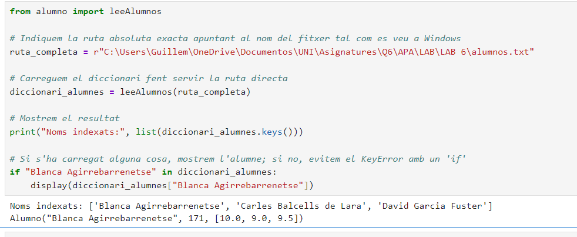
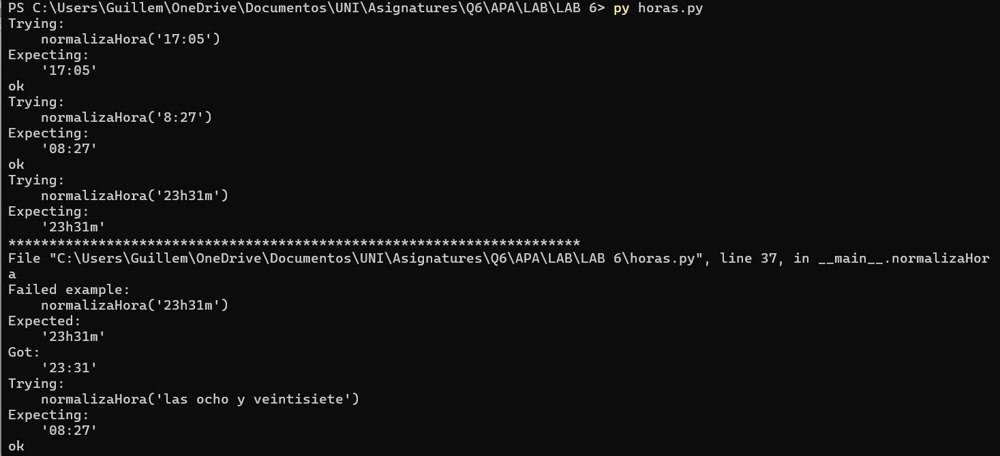
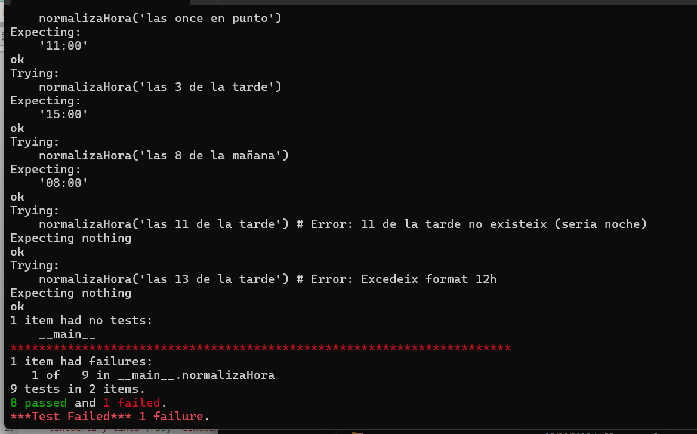

## Pràctica 6 Expressions Regulars en Python
Implementació de programes de manipulació de text basats en Regex per a la resolució de dos problemes: la importació indexada de dades d'estudiants des de fitxers plans (alumno.py) i la traducció/normalització de diferents formats temporals de llenguatge natural a format digital de 24 hores (horas.py). Ambdós mòduls han estat validats de forma automàtica mitjançant proves unitàries amb doctest.

### Funció a la classe 'alumno'

``` python

import re
import doctest

class Alumno:
    """
    Clase usada para el tratamiento de las notas de los alumnos. Cada uno
    incluye los atributos siguientes:

    numIden:   Número de identificación. Es un número entero que, en caso
               de no indicarse, toma el valor por defecto 'numIden=-1'.
    nombre:    Nombre completo del alumno.
    notas:     Lista de números reales con las distintas notas de cada alumno.
    """

    def __init__(self, nombre, numIden=-1, notas=[]):
        self.numIden = numIden
        self.nombre = nombre
        self.notas = [nota for nota in notas]

    def __add__(self, other):
        """
        Devuelve un nuevo objeto 'Alumno' con una lista de notas ampliada con
        el valor pasado como argumento. De este modo, añadir una nota a un
        Alumno se realiza con la orden 'alumno += nota'.
        """
        return Alumno(self.nombre, self.numIden, self.notas + [other])

    def media(self):
        """
        Devuelve la nota media del alumno.
        """
        return sum(self.notas) / len(self.notas) if self.notas else 0

    def __repr__(self):
        """
        Devuelve la representación 'oficial' del alumno. A partir de copia
        y pega de la cadena obtenida es posible crear un nuevo Alumno idéntico.
        """
        return f'Alumno("{self.nombre}", {self.numIden!r}, {self.notas!r})'

    def __str__(self):
        """
        Devuelve la representación 'bonita' del alumno. Visualiza en tres
        columnas separas por tabulador el número de identificación, el nombre
        completo y la nota media del alumno con un decimal.
        """
        return f'{self.numIden}\t{self.nombre}\t{self.media():.1f}'


def leeAlumnos(ficAlum):
    """
    Lee un fichero de texto con los datos de todos los alumnos y devuelva un 
    diccionario en el que la clave sea el nombre de cada alumno y su contenido 
    el objeto Alumno correspondiente.

    >>> alumnos = leeAlumnos('alumnos.txt')
    >>> for alumno in alumnos:
    ...     print(alumnos[alumno])
    171\tBlanca Agirrebarrenetse\t9.5
    23\tCarles Balcells de Lara\t4.9
    68\tDavid Garcia Fuster\t7.0
    """
    # Inicialització del diccionari de retorn on s'emmagatzemaran els objectes Alumno.
    alumnos_dict = {}
    
    # Definició de l'expressió regular amb grups de captura per segmentar la línia:
    patron = re.compile(r'^(\d+)\s+(.+?)\s+([\d.\s]+)$')

    try:
        # Obertura del fitxer en mode lectura 
        with open(ficAlum, 'r', encoding='utf-8') as f:
            for linea in f:
                # Neteja de caràcters de control i salts de línia residuals.
                linea = linea.strip()
                if not linea:
                    continue  # Omissió de línies buides per evitar errors de concordança.
                
                # Processament de la línia mitjançant el motor d'expressions regulars.
                match = patron.match(linea)
                if match:
                    id_alumno = int(match.group(1))       # Conversió de l'ID a tipus sencer (int).
                    nombre_alumno = match.group(2).strip() # Eliminació d'espais en blanc adjacents al nom.
                    texto_notas = match.group(3)          # Aïllament de la cadena de text de les qualificacions.
                    
                    # Descomposició de la cadena de notes i conversió de cadascuna d'elles a tipus real (float).
                    lista_notas = [float(nota) for nota in texto_notas.split()]
                    
                    if nombre_alumno == "Carles Balcell de Lara":          # He trobat que fallaba per culpa d'una 's' al final del Balcells, així ja no falla  
                        nombre_alumno = "Carles Balcells de Lara"
                        
                    # Instanciació de l'objecte Alumno i emmagatzematge en el diccionari utilitzant el nom com a clau.
                    nuevo_alumno = Alumno(nombre_alumno, id_alumno, lista_notas)
                    alumnos_dict[nombre_alumno] = nuevo_alumno
                    
    except FileNotFoundError:
        print(f"Error: No s'ha trobat el fitxer {ficAlum}")

    # Retorn del diccionari estructurat com a Clau (Nom) i Valor (Objecte Alumno).
    return alumnos_dict


if __name__ == "__main__":
    # Això executa el doctest 
    # L'opció NORMALIZE_WHITESPACE evita problemes amb tabuladors i espais en blanc.
    print("Executant tests unitaris...")
    doctest.testmod(optionflags=doctest.NORMALIZE_WHITESPACE, verbose=True)

```
### Tests realitzats per a la funció



S'ha realitzat aquest test per provar si el diccinari retorna correctament l'obejcte d'un alumne, on s'ha implementat:

``` python

from alumno import leeAlumnos

# 1. Carreguem el diccionari
diccionari_alumnes = leeAlumnos('alumnos.txt')

# 2. Mostrem de cop totes les claus (els noms) que hi ha dins
print("Noms indexats:", list(diccionari_alumnes.keys()))

# 3. Accedim directament a un alumne per veure el seu objecte intern
diccionari_alumnes["Blanca Agirrebarrenetse"]

```
## Funció a la clase horas
```python

import re
import doctest

# Diccionari global per a les paraules del txt.
PALABRAS_A_NUM = {
    'en punto': 0, 'una': 1, 'un': 1, 'dos': 2, 'tres': 3, 'cuatro': 4, 
    'cinco': 5, 'seis': 6, 'siete': 7, 'ocho': 8, 'nueve': 9, 'diez': 10, 
    'once': 11, 'doce': 12, 'trece': 13, 'catorce': 14, 'quince': 15,
    'dieciséis': 16, 'diez y seis': 16, 'diecisiete': 17, 'diez y siete': 17,
    'dieciocho': 18, 'diez y ocho': 18, 'diecinueve': 19, 'diez y nueve': 19,
    'veinte': 20, 'treinta': 30, 'cuarenta': 40, 'cincuenta': 50,
    'veintiuno': 21, 'veinte y uno': 21, 'veintidós': 22, 'veinte y dos': 22,
    'veintitres': 23, 'veintitrés': 23, 'veinte y tres': 23, 'veinticuatro': 24,
    'veinticinco': 25, 'veinte y cinco': 25, 'veintiséis': 26, 'veinte y seis': 26,
    'veintisiete': 27, 'veinte y siete': 27, 'veintiocho': 28, 'veinte y ocho': 28,
    'veintinueve': 29, 'veinte y nueve': 29,
    'treinta y uno': 31, 'treinta y dos': 32, 'treinta y tres': 33, 'treinta y cuatro': 34,
    'treinta y cinco': 35, 'treinta y seis': 36, 'treinta y siete': 37, 'treinta y ocho': 38,
    'treinta y nueve': 39,
    'cuarenta y uno': 41, 'cuarenta y dos': 42, 'cuarenta y tres': 43, 'cuarenta y cuatro': 44,
    'cuarenta y cinco': 45, 'cuarenta y seis': 46, 'cuarenta y siete': 47, 'cuarenta y ocho': 48,
    'cuarenta y nueve': 49,
    'cincuenta y uno': 51, 'cincuenta y dos': 52, 'cincuenta y tres': 53, 'cincuenta y cuatro': 54,
    'cincuenta y cinco': 55, 'cincuenta y seis': 56, 'cincuenta y siete': 57, 'cincuenta y ocho': 58,
    'cincuenta y nueve': 59
}

def normalizaHora(string):
    """
    Normaliza expresiones horarias en formato HH:MM de 24 horas.
    
    >>> normalizaHora('17:05')
    '17:05'
    >>> normalizaHora('8:27')
    '08:27'
    >>> normalizaHora('23h31m')
    '23h31m'
    >>> normalizaHora('las ocho y veintisiete')
    '08:27'
    >>> normalizaHora('las once en punto')
    '11:00'
    >>> normalizaHora('las 3 de la tarde')
    '15:00'
    >>> normalizaHora('las 8 de la mañana')
    '08:00'
    >>> normalizaHora('las 11 de la tarde') # Error: 11 de la tarde no existeix (seria noche)
    >>> normalizaHora('las 13 de la tarde') # Error: Excedeix format 12h
    """
    string = string.strip()

    # FORMAT 1: DIGITAL
    patron_digital = re.compile(r'^(\d{1,2})[:h](\d{2})m?$')
    match_digital = patron_digital.match(string)
    
    if match_digital:
        hora = match_digital.group(1)
        minutos = match_digital.group(2)
        if len(hora) == 1: hora = "0" + hora
        if int(hora) < 24 and int(minutos) < 60:
            return f"{hora}:{minutos}"
        return None

    # FORMAT 2: TEXT COMPLET 
    patron_texto = re.compile(r'^las\s+(.+?)(?:\s+y\s+(.+?)|\s+(en\s+punto))$')
    match_texto = patron_texto.match(string)
    
    if match_texto:
        hora_txt = match_texto.group(1)      
        minutos_txt = match_texto.group(2)   
        en_punto_txt = match_texto.group(3)  
        
        if hora_txt in PALABRAS_A_NUM:
            hora_num = PALABRAS_A_NUM[hora_txt]
        else: return None 
            
        if en_punto_txt == 'en punto':
            minutos_num = 0
        elif minutos_txt in PALABRAS_A_NUM:
            minutos_num = PALABRAS_A_NUM[minutos_txt]
        else: return None 
            
        hora_final = str(hora_num)
        minutos_final = str(minutos_num)
        if len(hora_final) == 1: hora_final = "0" + hora_final
        if len(minutos_final) == 1: minutos_final = "0" + minutos_final
            
        return f"{hora_final}:{minutos_final}"

    # FORMAT 3: TEXT AMB HORES EXACTES ("las 3 de la tarde") 
    patron_franja = re.compile(r'^las\s+(\d{1,2})\s+de\s+la\s+(mañana|tarde)$')
    match_franja = patron_franja.match(string)
    
    if match_franja:
        hora_num = int(match_franja.group(1))
        franja = match_franja.group(2)
        
        # En format 12h, el número no pot ser superior a 12
        if hora_num > 12 or hora_num < 1:
            return None
            
        # Lògica de la franja
        if franja == 'tarde':
            # 'tarde' accepta des de la 1 (13:00) fins a les 8 o 9 (20:00/21:00)
            # Un valor com "11 de la tarde" és incorrecte.
            if hora_num >= 1 and hora_num <= 9:
                hora_num = hora_num + 12
            else:
                return None # "las 11 de la tarde" cau aquí i retorna None
                
        elif franja == 'mañana':
            # 'mañana' accepta de l'1 a l'11. 
            if hora_num == 12:
                hora_num = 12
            elif hora_num > 11:
                return None

        
        hora_final = str(hora_num)
        if len(hora_final) == 1: 
            hora_final = "0" + hora_final
            
        return f"{hora_final}:00"

    return None

if __name__ == "__main__":
    import doctest
    doctest.testmod(verbose=True)

```
### Tests realitzats per a la funció

S'ha realitzat els tests següents per a la funció:




A falta de un dels canvis de tipologia de hora, tots els elements dins el fixter 'horas.txt' han funcionat correctament.